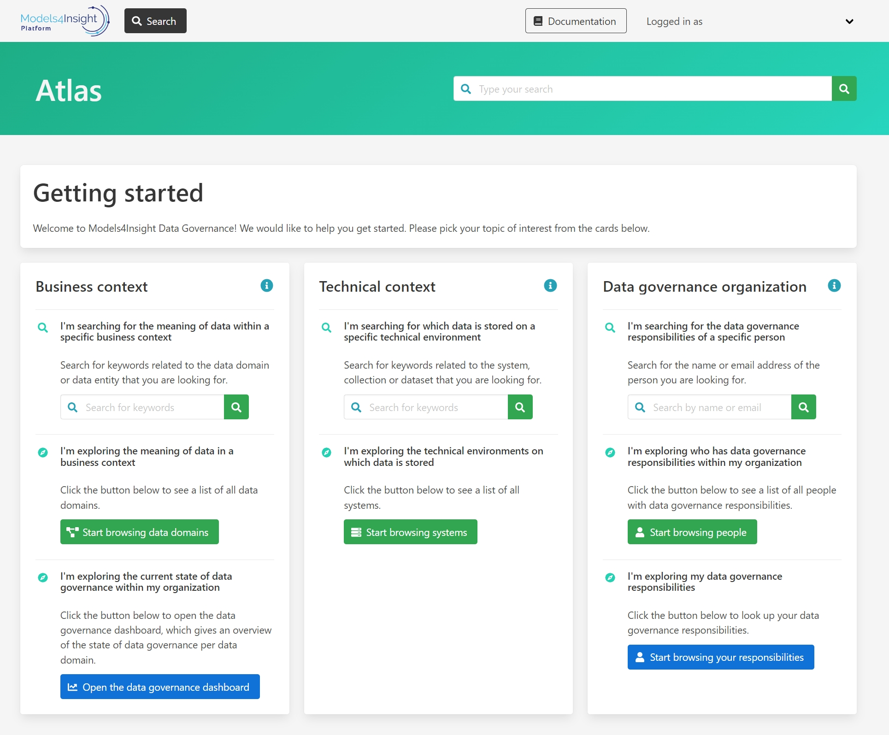

How to access the Demo Environment
==================================

Use the link below to sign in or :ref:`Click here<indexStory>` to learn more about user stories.

.. raw:: html

     <a href="https://aureliusdev.westeurope.cloudapp.azure.com/demo/atlas/" target="_blank">Link to Demo</a>

``! NOTE:  Gmail account is needed to Sign in.``

.. image:: imgs-acess/login.jpg
     

Once you are logged in, this is how the demo ewnvironment looks like.

