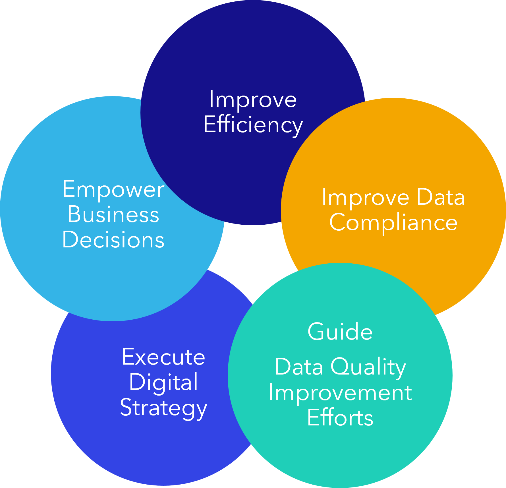

Benefits of Aurelius Atlas Data Governance Solution
===================================================

Data governance establishes a common understanding of the data and how
it is applied and used by the business.

Here's how we help businesses:

**1. Empower business decisions**

   Having a single source of truth on the data.

   Business can identify and prioritize data products based on its
   needs.

**2. Improve efficiency**

   Allowing data users to quickly determine if the data fits for their purpose;
   such as if the data contains the fields needed for a project and if so
   where to find it and who is accountable for it.

   Further analysis on the process helps a lot with the improvement.

**3. Improve Data Compliance**

   Letting user keep track of sensitive information, they will know if the data
   is compliant with data protection regulations such as keeping
   track of personally identifiable information(PII).

**4. Guide data quality improvement efforts**

   An impact analysis on the quality can help user prioritize their
   efforts to increase the data quality, which will reduce the
   operational errors and increase the analytical accuracy.

   With the combination of the first four benefits the fifth benefit can
   be gained.

**5. Execute digital strategy**

   A digital strategy helps get the data product to market faster and the business can
   gain more value from refined data.

