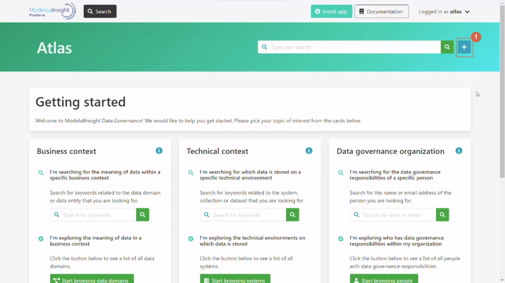
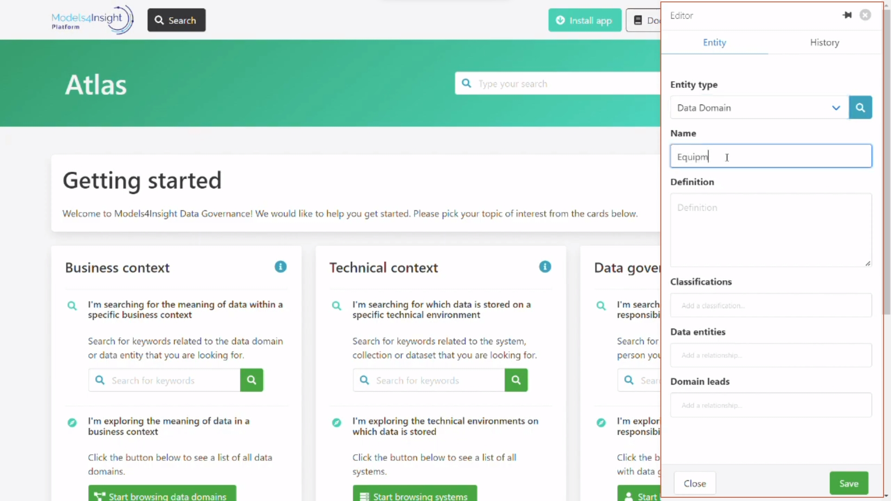
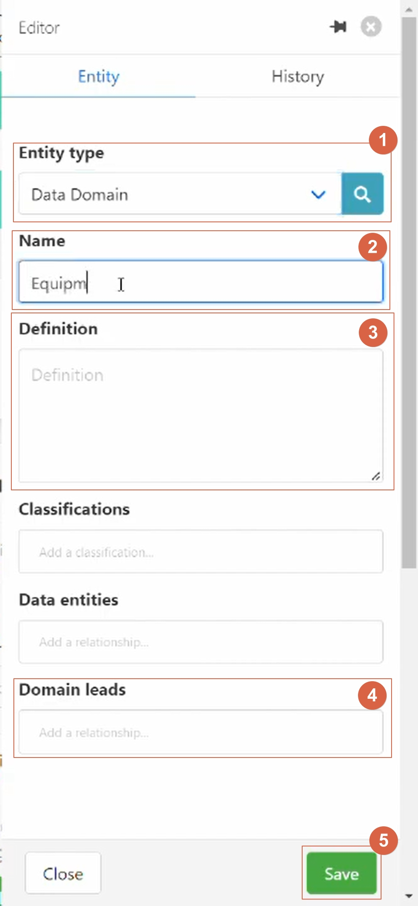
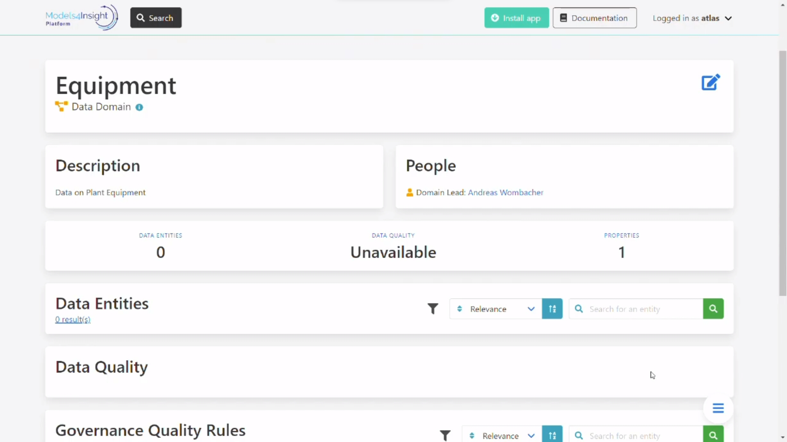
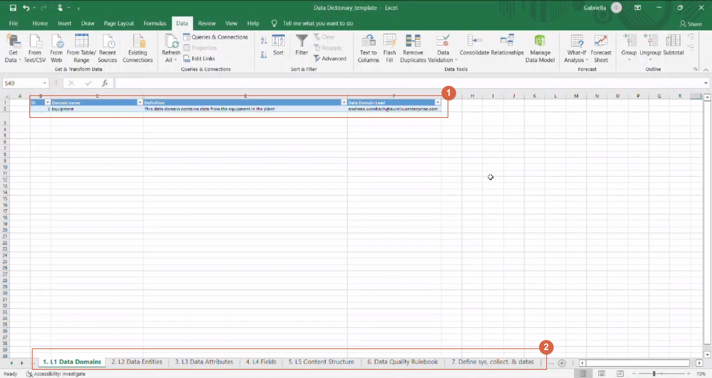
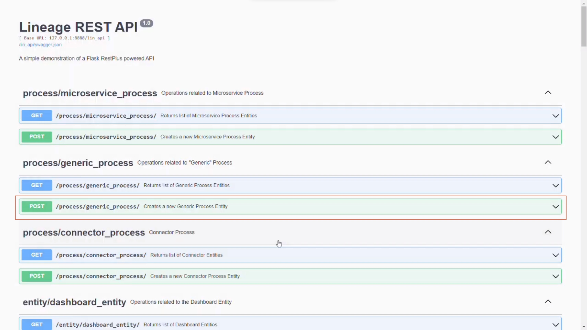
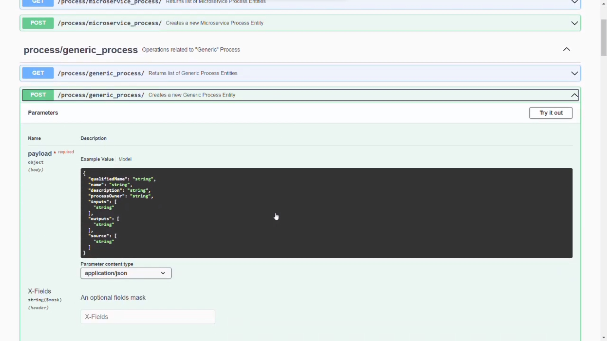

Simple ways to get your data in
===============================
.. _simple:

You can experience the user stories by yourself :ref:`Clicking here<indexStory>`.
The demo environment is read only, thus you will not be able to modify or create concepts yourself.
There are three ways to get data into the solution:

**1.Creating Entities manually in the front end.**
--------------------------------------------------

``1 – Click on the plus button``

Then appears a side page, for create the entity

Let’s have a close look to the creation entity page

``1 – Entity type: this case is a Data domain.``

``2 – Name.``

``3 – Definition.``

``4 – Domain lead.``

``5 – Save button.``

Once you log in, this is what the demo Environment looks like.

**2.Use an excel data dictionary that can bulk push multiple entities at once.**
--------------------------------------------------------------------------------

``1 – You can fill the name, description and data ownership rule.``

``2 – Use to create business data in bulk.``

**3.Use the Lineage REST API that can be connected to directly with a  script or infrastructure.**
--------------------------------------------------------------------------------------------------

The Lineage REST API, provides various endpoints to get and create (post) entities of  different entity types. 
To see the full list of the endpoints available and the required request fields, take a look at the **Lineage REST API swagger**. 
(link to swagger)  
A business can collect the metadata during creation or retrospectively during scanning form their tecnnology, 
and this can connect the API, to push the data to the solution.
A script can scan the existing system or systems in place and make POST requests to generate the entity on Aurelius Atlas capturing the technical systems, 
collections, datasets, fields, and processes. Similarly, when deploying infrastructure as code, 
requests can be made to the Lineage REST API to represent the components being deployed capturing the technical information. 

In this image you can see the swagger documentation of the Lineage REST API. 

Extedending an option you can see the expected payload or body that can be sent to the Lineage REST API to create the Generic Process Entity.

      
