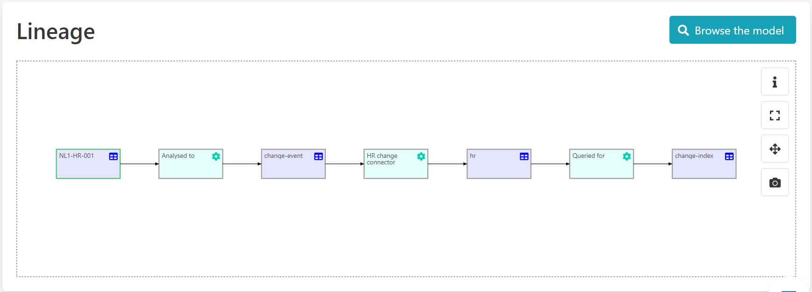
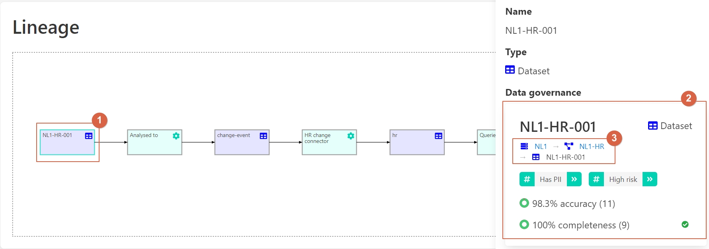
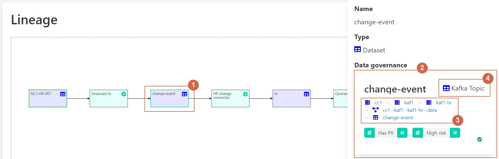
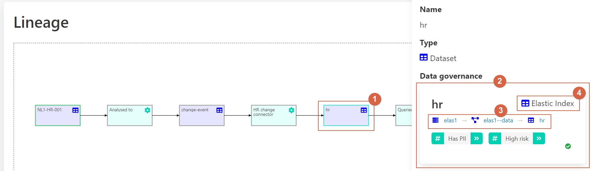
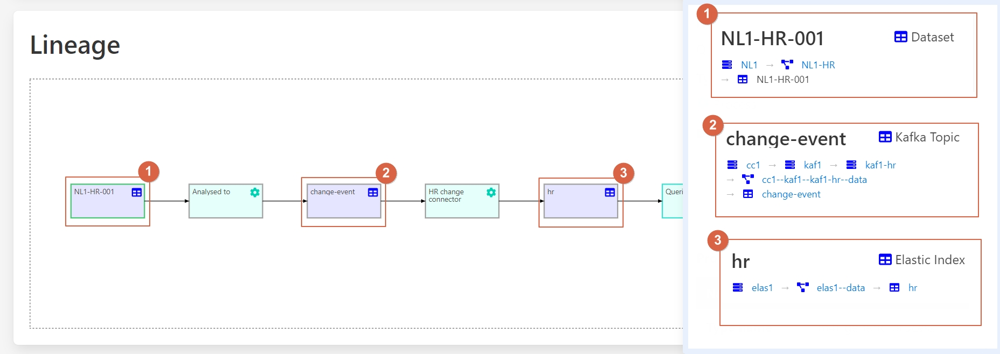
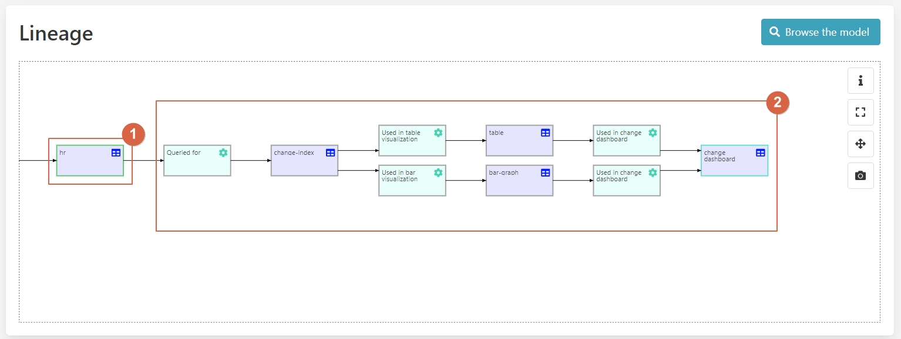
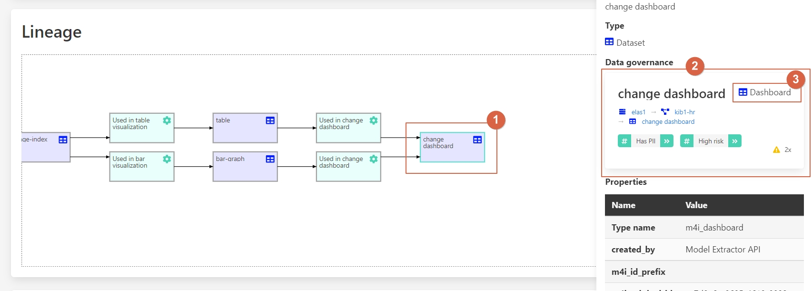

Cross data platform data governance
===================================

User story 
----------
Data management is using solutions from different vendors, potentially even in different clouds or in a cloud and some parts on premise.
The data governance solutions of the different cloud providers focus on data governance of their specific solutions.
Thus, for the organization it is very difficult to get an overview of the available data and the related data flows across the different solutions and platforms. 

This is a challenge, because there is no single google for the data catalog to find the right information.
While a data catalog purpose is to provide an overview of available data in systems organization wide. 

By using Aurelius Atlas, data governance information from various independent systems can be collected and their data flows can be related. 
This way, Aurelius Atlas becomes the google for the organizations data management.  

To illustrate the process of finding relevant information across various system the following scenario is used:
An implementer of data pipeline, you want to update schema of a particular table,
so you want to know who is using the data and where are this different data being used to make sure that they also adjust their schema and the subsequent pipelines. 

Step by step guide
------------------
In the `previous demo <userStory2>`__, you saw a linage example where data was flowing across different platforms 

In this specific case data is acquired from a **relational database**

``1 – Source data.``

``2 – Information about this data.``

``3 – Where it is stored.``

Then transferred into a Kafka topic to communicate the change events of the
relational database via **Change Data Capture (CDC)**

``1 – Source code.``

``2 – Information about this data.``

``3 – Where it is stored.``

``4 – Converted to a Kafka topic.``

Then the data is stored as a state in elastic search storage 

``1 – Source code.``

``2 – Information about this data.``

``3 – Where it is stored.``

``4 – Converted into an Elastic index.``

In the **linage graph** of **NL1-HR-001** the implementor sees three different systems: a **SQL server**, a **Kafka system** and an **Elastic system**.
All data is consistently recorded across the different environments in **Aurelius Atlas**. 

Let’s click on **hr**, to see specific information related to this entity

``1 – hr entity.``

``2 – specific information about this entity.``

 

The available data is then visualized in a **Kibana dashboard**,
to access to it, let’s click on the last event of the **lineage model**. 

``1 – Dashboard.`` 

``2 – Info about the entity.`` 

``3 - Kibana dashboard.`` 

Benefits 

**1– Lineage graph shows database -> Kafka -> Elastic**

**2 – Different representations for different systems**

**3 – Type system is extendable** 