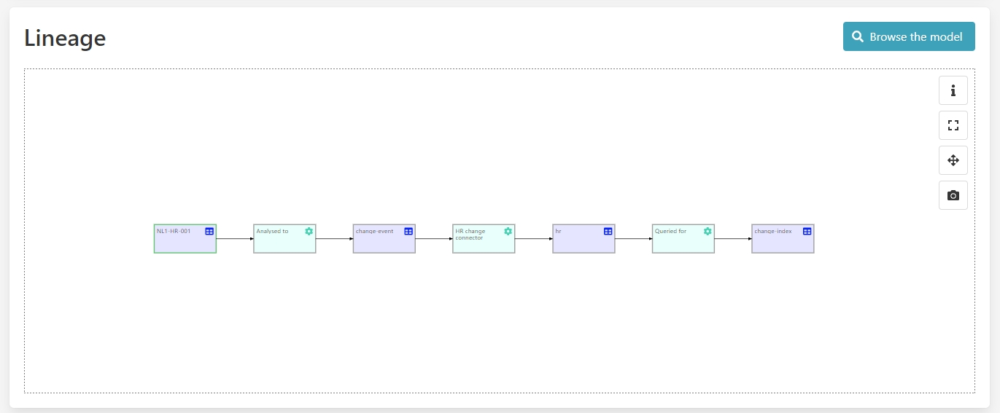
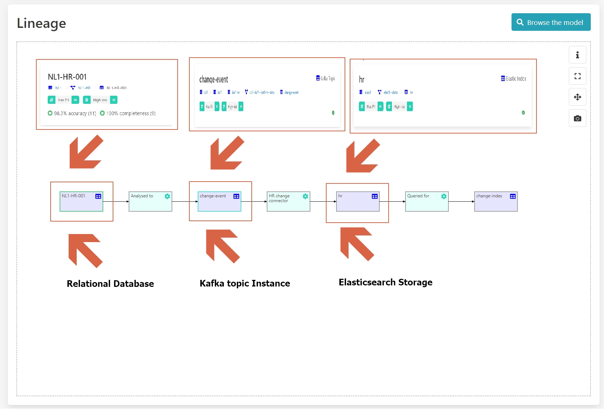

Cross data platform data governance
===================================
.. _userStory3:

(What is the problem?)

(Why is this a problem?)

(How we solve it?)

(Example scenario)

In the `previous demo <user-story-2>`, you saw how the data was
captured across platforms, so in our specific case here we use a
relational database and then a Kafka instance to communicate the change
events and then store the state in elastic search storage.

We make the data available in the Kibana dashboard, so here we have
three different systems a server a **SQL server**, a **Kafka system**
and an **Elastic system** and we record all data consistently across the
different environments in our Aurelius Atlas tooling

Benefits

**1 – Select dataset NL1-HR-001**

**2 – Lineage graph shows database -> Kafka -> Elastic**

**3 – Different representations for different systems**

**4 – Type system is extendable**