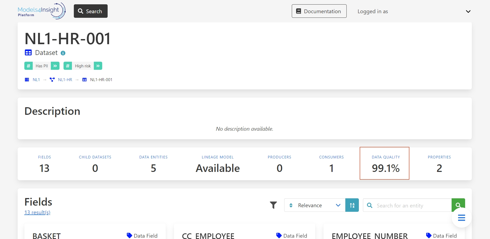
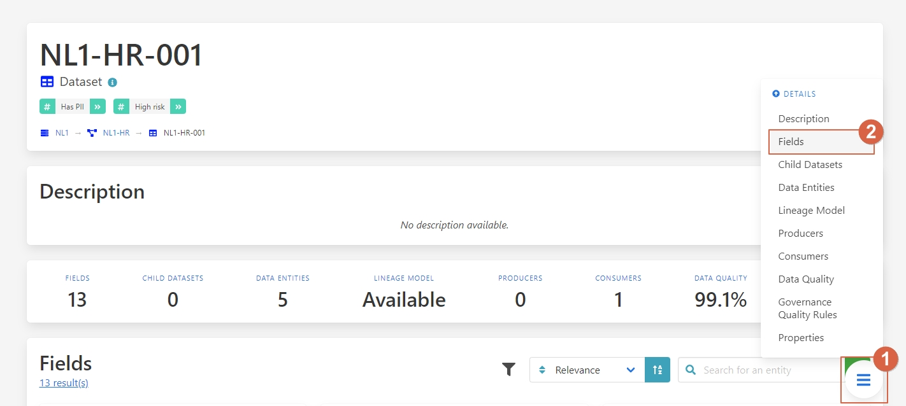

Find data fast and observed quality metrics
===========================================
.. _userStory4:

As a user, you can be interested in having a clear vision of the quality of your data and how you can obtain the best quality from it.
Let’s look for some data, found a data set and go to its page.
You have, an overview of the overall data quality of the data set can be seen.
What we see here is that the quality is not a hundred percent.

Let’s go to this section, to see the fields:

``1 - Press on the button.``

``2 – Select Fields.``

Here we can see the quality of each field and identify where the quality is not being met.

.. image:: imgs-user-story4/third.jpg

If your project only requires **FTE** and **location** fields in which the quality is high, 
you can ignore the bad quality of the unrelated fields.

.. image:: imgs-user-story4/fourth.jpg

However, if you require the **HIER ORGANIZATION** field, 
you can notice that the precision is low.

.. image:: imgs-user-story4/fifth.jpg

Let’s go to the Data Quality Rules:

``1 - Press on the button.``

``2 – Select Data Quality Rules.``

.. image:: imgs-user-story4/six.jpg

You can see that the syntax of the field is not always being followed.

.. image:: imgs-user-story4/seven.jpg

With this information, you can now understand the limitations of the dataset.

Let’s go to the Data Attributes:
1 - Press on the button
2 – Select Data Attributes.

.. image:: imgs-user-story4/eigth.jpg

As you can see in this picture:
.. image:: imgs-user-story4/nine.jpg

``1 - Name and results.``

``2 - Filter and search bar.``

``3 - Attributes.``

``4 - People in charge of this data.``

In this way, you can have your data always updated to always guarantee good quality in it, 
because you can know who oversees it and ask them to clean it up.

Benefits

**1 – Great insight into data quality.**

**2 – Easy to find the person in charge of the data.**
