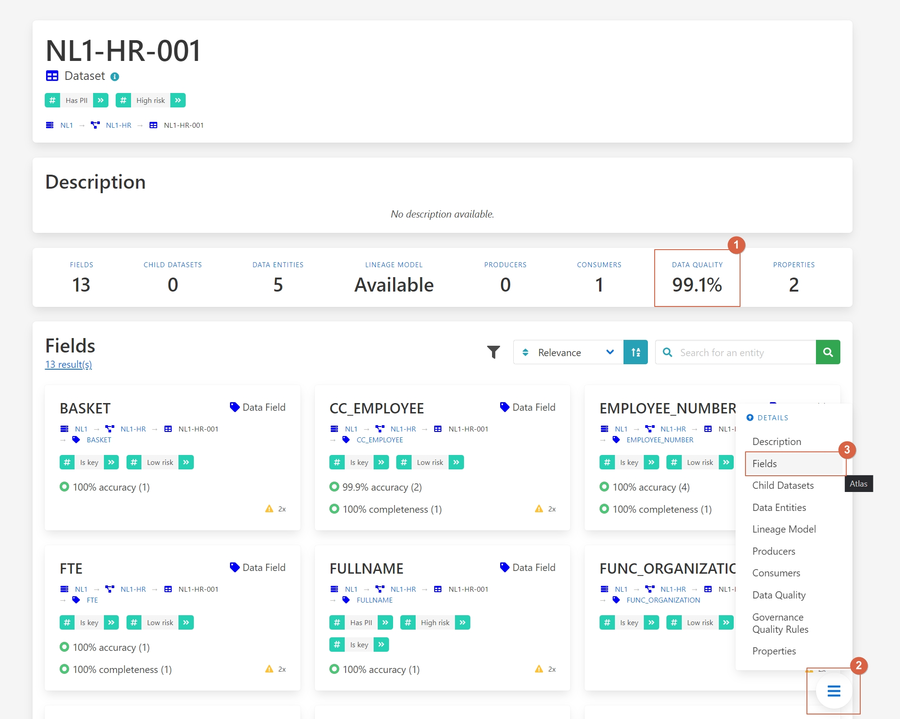
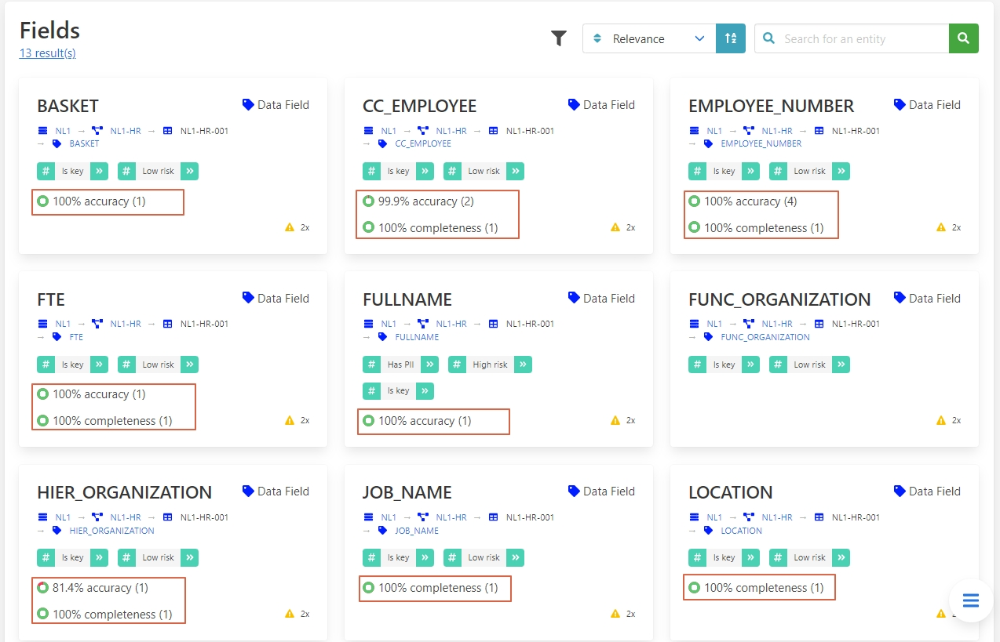
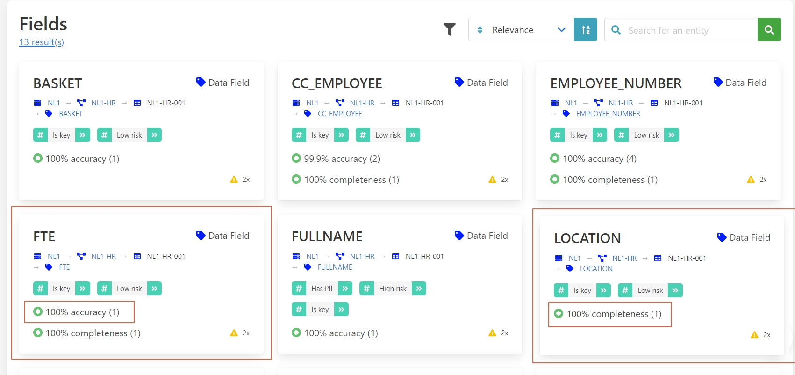
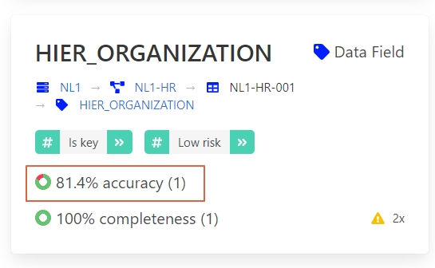
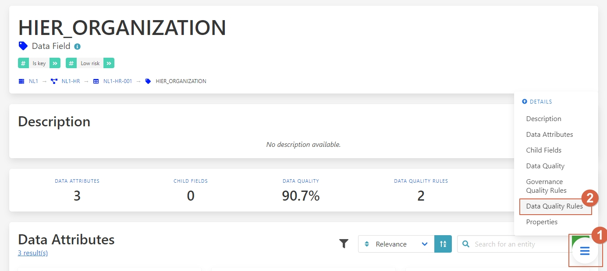
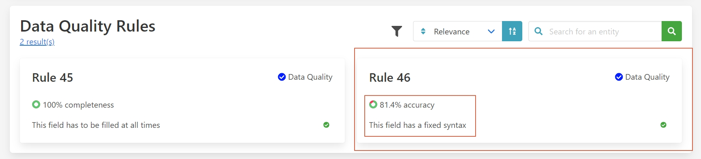
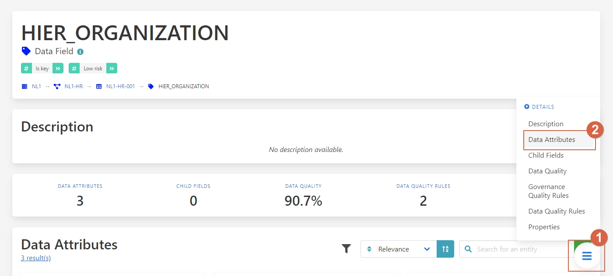
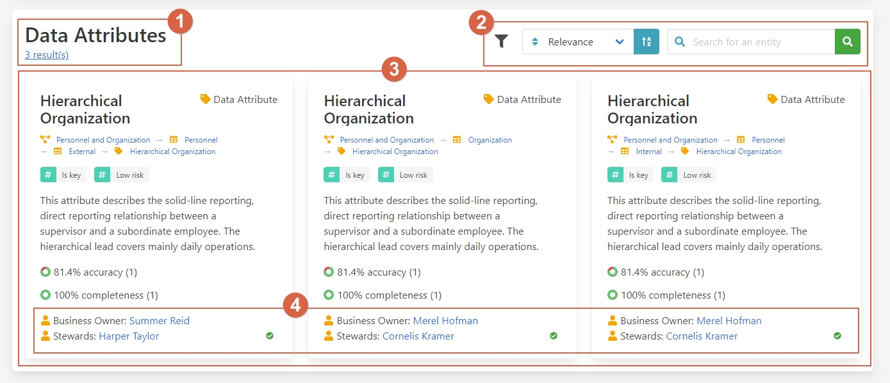

Find data fast and observed quality metrics
===========================================
.. _userStory4:

.. raw:: html

    <iframe width="560" height="315" src="https://www.youtube.com/embed/QBZ80l5jpvE" title="YouTube video player" frameborder="0" allow="accelerometer; autoplay; clipboard-write; encrypted-media; gyroscope; picture-in-picture" allowfullscreen></iframe>

User Story
----------

Next to data governance, data quality is another core pillar of data management. 
Good data quality helps make data more useful and usable, resulting in better business outcomes.
Meanwhile, bad data quality limits the value of data, and results in worse business outcomes. 

Data quality can be measured in many ways. 
It is the responsibility of the data governance organisation to define data quality metrics.
Data quality is typically measured along the following dimensions:

| Dimension    | Description                                                                                                             |
|--------------|-------------------------------------------------------------------------------------------------------------------------|
| Accuracy     | Whether or not the data contains errors. For example, a person's name should always be correct.                         |
| Completeness | Whether or not each row of the data has a value. For example, a person should always have a name.                       |
| Timeliness   | Whether or not the data is up to date. For example, the data should only include people currently employed.             |
| Uniqueness   | Whether or not values that need to be unique, actually are unique. For example, every employee should have a unique ID. |
| Validity     | Whether or not the data fits with a predefined format. For example, a person's initials should always be capitalized.   |

For every dimension, one or more data quality rules can be defined.
For every rule, a percentage score is assigned. 
A score of 100% indicates that the dataset is perfectly compliant with that particular rule.

A lower data quality score for a particular rule indicates that there are data quality issues.
The impact and consequences of these issues depends on the characteristics of the dataset.

Typically, manually entered data tends to be of lesser quality than automatically generated data.
Improving the data quality of manually entered data tends to involve the education of people and process improvements.
Meanwhile, lower data quality scores for automatically generated data may indicate a bug in the system.

Data quality should be measured at every system where the data is stored, since data transformations can cause data quality to change.
If there are data quality issues, these should be solved at the point where the data quality issues are introduced.
This is typically at the place where the master data is stored.

Aurelius Atlas allows for the discovery and insight of your organisation's data quality across data sources.
This allows for better business outcomes for users of data.
The tool also allows the people responsible for data quality to do root cause analysis of data quality issues.

The following example demonstrates how data of good quality is discovered by a data scientist.

Step by step guide
------------------

``1 - Data quality.``

``2 – Press on the button.``

``3 - Selec Fields.``

Here we can see the quality of each field and identify where the quality is not up to standar.

If your project only requires **FTE** and **location** fields in which the quality is high, 
you can ignore the lower quality of the unrelated fields.

However, if you require the **HIER ORGANIZATION** field, 
you can notice that the precision is low.

Let’s go to the Data Quality Rules

``1 - Press on the button.``

``2 – Select Data Quality Rules.``

You can see that the syntax of the field is not always being followed.

With this information, you can now understand the limitations of the dataset.

Let’s go to the Data Attributes

``1 - Press on the button.``

``2 – Select Data Attributes.``

As you can see in this picture

``1 - Name and results.``

``2 - Filter and search bar.``

``3 - Attributes.``

``4 - People in charge of this data.``

This way, your data is always updated and you're guaranteed better quality, 
because you can know who oversees it and ask them to clean it up.

**Benefits**

**1 – Great insight into data quality.**

**2 – Easy to find the person in charge of the data.**
