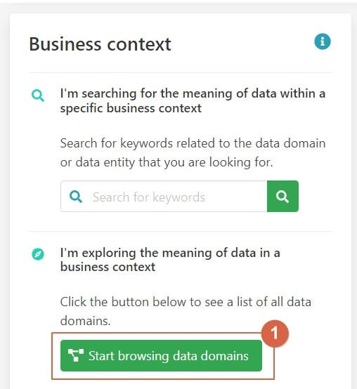
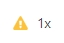
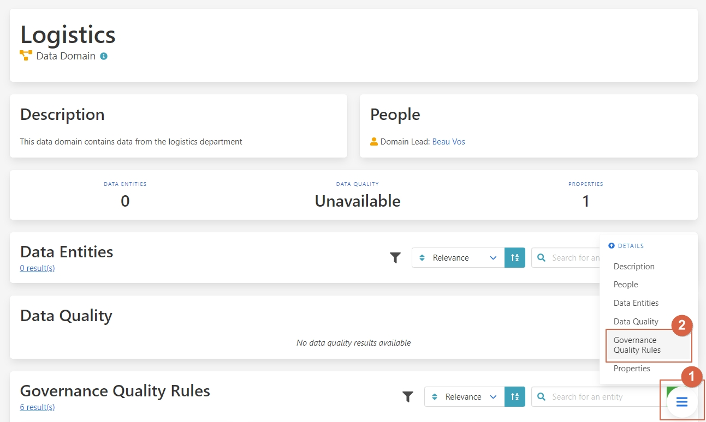

Keep track of your data governance quality
===============================
.. _userStory5:

    .. raw:: html
                
        <iframe width="560" height="315" src="https://www.youtube.com/embed/q6yFKAfdbSk" title="YouTube video player" frameborder="0" allow="accelerometer; autoplay; clipboard-write; encrypted-media; gyroscope; picture-in-picture" allowfullscreen></iframe>

User story
----------

When applying data management in an organisation, there are a lot of different aspects to consider. 
The data governance organisation needs to be set up.
Business and technical data governance models need to be set up.
And data quality needs to be monitored.

Keeping an overview of the organisation's progress in all these activities can be a challenge.
The Aurelius Atlas tool lets key stakeholders monitor the entire progress of the implementation, and the overall data governance quality.
It also allows for better decision making on where to focus for the next improvement. 

Every entity in Aurelius Atlas is checked against various data governance quality rules.
The result of this check is available at the bottom of every details page, as well as an indicator in the search results.
An entity can either be compliant with a rule, or not.
All compliant and non-compliant rules are counted. The ratio determines an overall data governance quality score.
This score is shown at the top of every details page.

The following example explains how to review data governance quality from the perspective of a business data steward.
It is their job to maintain data governance quality for their respective domain.
A data steward can use the Aurelius Atlas tool to get an overview of potential issues, and then drill down to the details.

Step by step guide
------------------
                
Let’s start from the business context card 

    ``1 – Click on "start browsing data domains".``

                
On the side of each card in the search, 
you can see a little icon that determines if the information about this entity is complete or not. 

.. image:: imgs-user-story5/two.jpg

    ``1 - Data type.``

    ``2 -  This checkmark means the entity is fully populated.``

    ``2 - This warning symbol means that the entity is not filled.``

Let’s click on Logistics entity to see why it has a warning.

 Once on the details page, let’s go to the Governance Quality Rules.

    ``1 - Press on the button.``

    ``2 – Select Governance Quality Rules.``

.. image:: imgs-user-story5/six.jpg

This indicates to the person responsible if the entity is complete or not, 
in this example, you see that the data domain has no data entities. 

Here are all the data governance rules that are applied to this entity.
This indicates to the person responsible that the entity is complete or not.
In this example, it can be seen that not all of them are fulfilled and that this data domain has no data entities.

**Benefits**

**1 – See how well data governance has been applied.**

**2 – Control your data.**

**3  – Empower business decisions.**